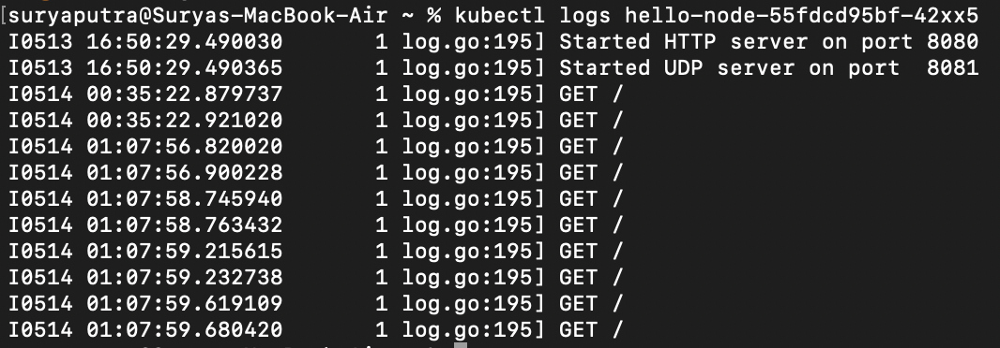
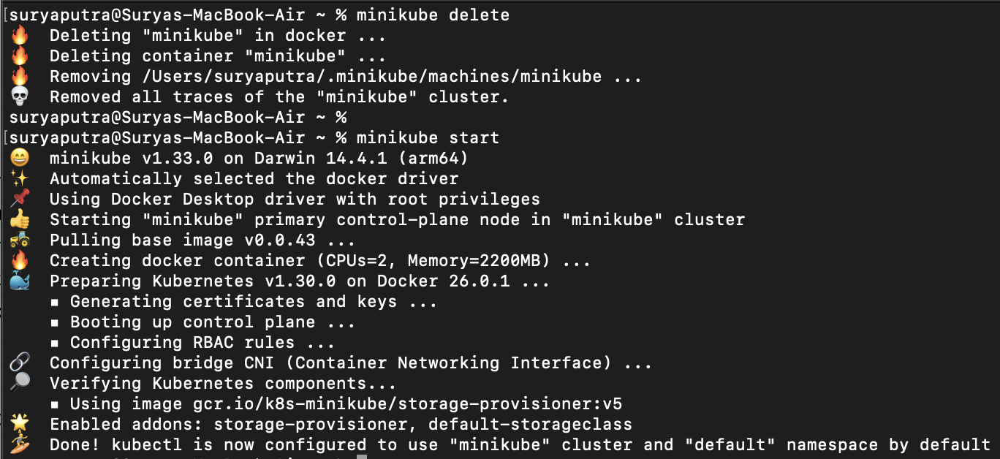
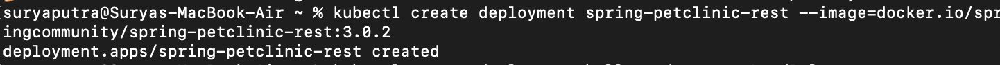
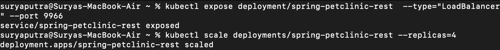
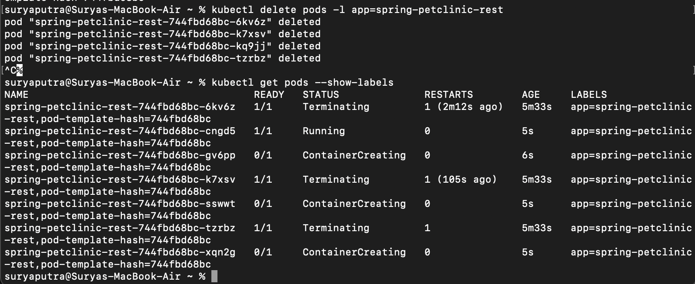
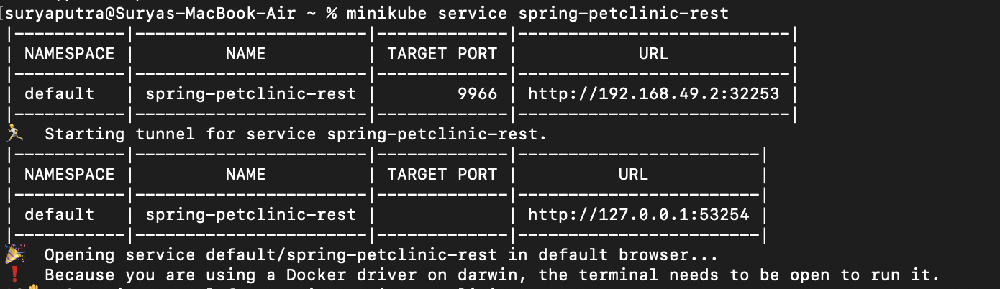
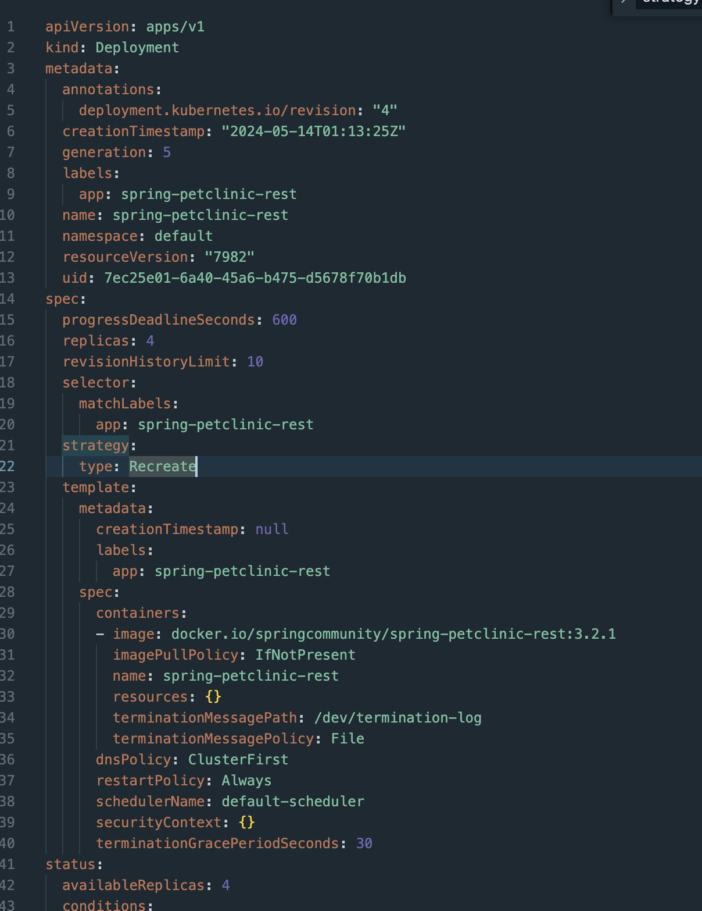
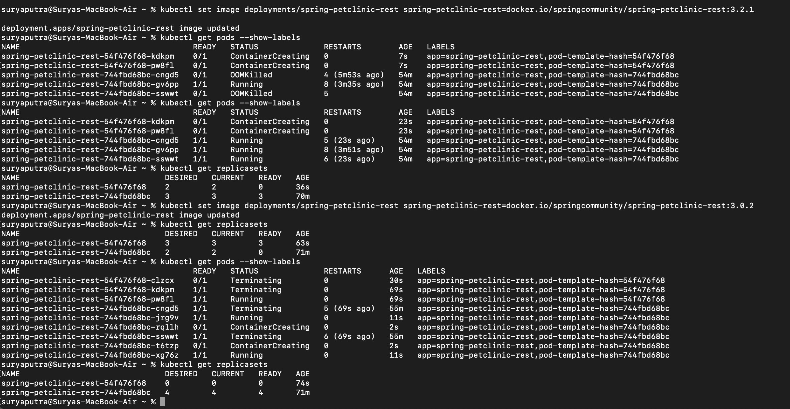

## Reflection on Hello Minikube

### 1. Compare the application logs before and after you exposed it as a Service. Try to open the app several times while the proxy into the Service is running. What do you see in the logs? Does the number of logs increase each time you open the app?
Terdapat perbedaan antara log aplikasi sebelum dan setelah Service di-expose. Setelah Service di-expose, aplikasi dapat menerima request dari luar, sehingga pada log akan tercatat request-request yang diterima. Misalnya, seperti yang terlihat pada log, ada beberapa entri untuk permintaan GET, yang merupakan hasil dari melakukan refresh atau akses berulang kali ke Service hello-node. Ini menunjukkan bahwa aplikasi secara aktif menangani permintaan masuk setelah dijadikan sebagai Service.

### 2. Notice that there are two versions of `kubectl get` invocation during this tutorial section. The first does not have any option, while the latter has `-n` option with value set to `kube-system`. What is the purpose of the `-n` option and why did the output not list the pods/services that you explicitly created?
Opsi -n digunakan untuk menentukan namespace tertentu dalam kluster Kubernetes. Namespace adalah cara untuk membagi sumber daya kluster ke dalam kelompok-kelompok yang terisolasi. Jadi, ketika perintah kubectl get dijalankan dengan -n kube-system, perintah tersebut hanya akan menampilkan sumber daya yang berada di dalam namespace kube-system. Alasan output tidak menampilkan pod atau service secara eksplisit adalah karena sumber daya tersebut kemungkinan besar dibuat di namespace default atau namespace lain yang tidak termasuk kube-system.

## Reflection on Rolling Update & Kubernetes Manifest File

### 1. What is the difference between Rolling Update and Recreate deployment strategy?
 Perbedaan utama antara strategi Rolling Update dan Recreate terletak pada cara mereka mengganti versi lama aplikasi dengan yang baru. Rolling Update melakukan pembaruan secara bertahap, dimana pod-pod baru digunakan secara bertahap menggantikan pod-pod lama. Sebaliknya, strategi Recreate menghentikan semua instance lama sebelum mengerahkan versi baru secara serentak, yang mengakibatkan downtime singkat selama proses pembaruan.

### 2. Try deploying the Spring Petclinic REST using Recreate deployment strategy and document your attempt.

Dapat dilihat Spring Petclinic REST tersebut sudah menggunakan recreate deployment strategy pada bagian screenshoot saat perintah delete pods dijalankan. Terlihat saat pods di delete, pods baru menggantikannya secara serentak dan menimbulkan downtime secara singkat sehingga tidak begitu terlihat. Dapat dilihat juga proses tersebut berhasil dan service sudah bisa berjalan pada localhost. 

### 3. Prepare different manifest files for executing Recreate deployment strategy.

Dapat dilihat pada screenshoot tersebut, ketika kita mengganti image pada file tersebut, pods yang lama akan dihapus dan kemudian akan mendeploy pods baru secara serentak yang sesuai dengan metode recreate deployment strategy. Manifest file saya berikan pada file yang bernama newdployment.yaml pada direktori ini yang sudah menggunakan recreate deployment strategy. 

### 4. What do you think are the benefits of using Kubernetes manifest files? Recall your experience in deploying the app manually and compare it to your experience when deploying the same app by applying the manifest files (i.e., invoking `kubectl apply -f` command) to the cluster.
Ketika kita menggunakan manifest file, kita tidak perlu lagi melakukan prosedur yang diperlukan untuk melakukan pembaruan atau deployment pertama kali. Selain itu, menggunakan manifest file juga mengurangi kemungkinan terjadinya human error. Dengan manifest file, layanan yang dibuat sudah pasti sesuai dengan isi dari file tersebut. Dalam pengalaman saya, melakukan deployment aplikasi secara manual memerlukan banyak langkah dan rentan terhadap kesalahan, sedangkan dengan kubectl apply -f, semua konfigurasi dan langkah-langkah deployment bisa dilakukan dengan satu perintah sederhana, membuat proses mejadi lebih cepat, dan lebih mudah.